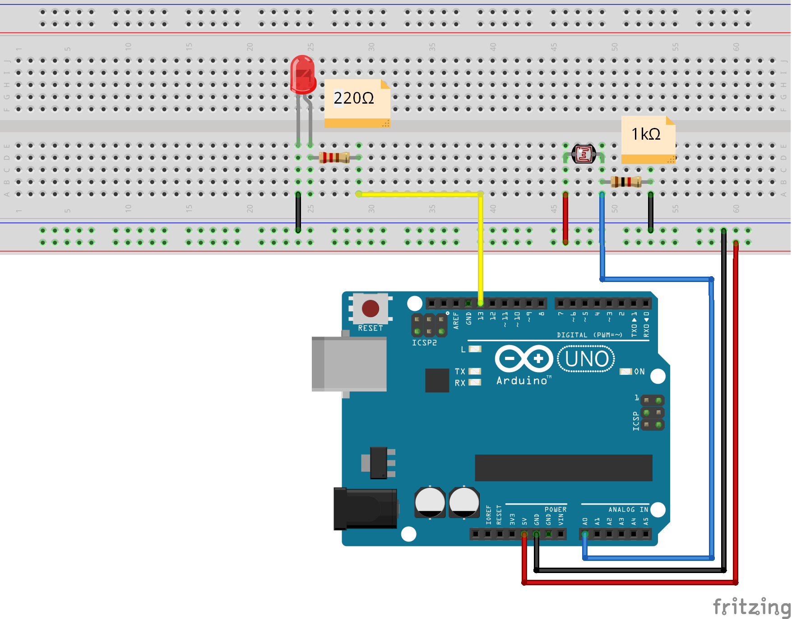

# project-WiE-October2019

## Description
Το παρόν αποθετήριο είναι μέρος της δράσεις του φοιτητικού παραρτήματος του ΙΕΕΕ που θα 
διεξαχθεί την Τετάρτη 16/10/2019 στο ΓΕΛ Μεσοποταμίας με στόχο την προώθηση του Women in 
Engineering και την ενίσχυση του θεσμού της γυναίκας μηχανικού. Με αφορμή την παγκόσμια εορτή 
της Ada Lovelace Day θα διεξαχθεί το παρόν Arduino Workshop με σκοπό την γνωριμία με το 
Arduino, τα ηλεκτρονικά κυκλώματα και τον προγραμματισμό στα κορίτσια του Λυκείου. Το σενάριο 
έχει ως στόχο την υλοποίηση ενός συστήματος έλεγχου φωτών με βάση τα επίπεδα της φωτεινότητας.  

Το σενάριο βασίζεται στα παρακάτω: 
 * Step 1 https://create.arduino.cc/projecthub/MisterBotBreak/how-to-use-a-photoresistor-46c5eb
 * Step 2 https://www.arduino.cc/en/Tutorial/Blink
 * Step 3 https://www.arduino.cc/reference/en/language/structure/control-structure/if/

Στο αποθετήριο υπάρχει το σχηματικό το οποίο δημιουργήθηκε με την χρήση του εργαλείου fritzing και ο κώδικας Arduino.

## Tools needed
- 1 x Arduino Uno
- 1 x Breadboard 
- 1 x Photocell
- 1 x LED
- 1 x 10K Ohm Resistor
- 1 x 220 Ohm Resistor
- 1 x USB Cable
- 7 x Jumper Cables 

## Installation 
- Κατέβασε τον κώδικα.
- Άνοιξε το  Arduino IDE και μεταφόρτωσε τον κώδικα.

## Usage
- Μπορείς αν θες να κατεβάσεις το Fritzing απο εδω: http://fritzing.org/download/.

